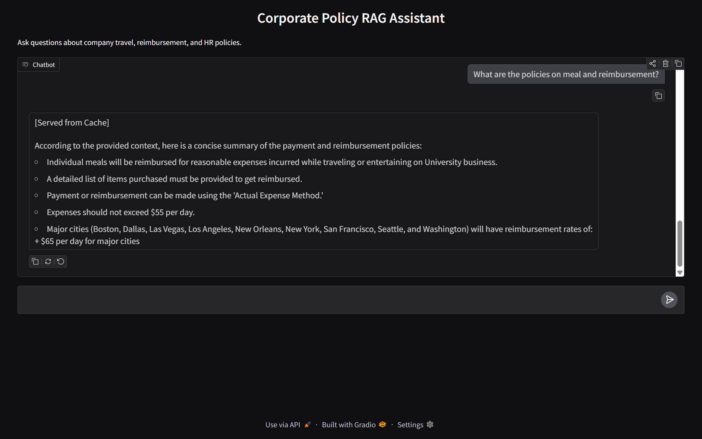

# Corporate-policy-rag



A local Retrieval-Augmented Generation (RAG) system designed to answer questions about corporate policies (e.g., travel, HR, and reimbursement). This project utilizes FastAPI for the backend API, Gradio for a real-time streaming user interface, and Ollama for local LLM inference.

## Architecture & Tech Stack

* **Generation Model:** `llama3.2:1b` (via local Ollama). A highly efficient 1-billion parameter model that executes fast enough locally.
* **Embedding Model:** `BAAI/bge-small-en-v1.5` (via `SentenceTransformers`). A lightweight (33M parameter) embedding model that generates dense 384-dimensional vectors.
* **Vector Database:** `ChromaDB` (Persistent). Stores document embeddings and metadata locally.
* **Chunking Strategy:** Two-Pass Pipeline.
    1.  **Semantic Split:** Uses IBM's `Docling` to convert PDFs to Markdown, preserving document hierarchy. LangChain's `MarkdownHeaderTextSplitter` then groups text logically by headers (`#`, `##`, `###`) to ensures that concepts stay together.
    2.  **Fallback Split:** A `RecursiveCharacterTextSplitter` (600 chunk size, 100 overlap) catches any oversized semantic sections to ensure they fit perfectly within the embedding model's context window.
* **Caching Layer:** Built-in `SQLite` database with Time-To-Live (TTL) expiration. Hashes incoming user queries using SHA-256 to instantly return previously generated answers without waking up the LLM, saving immense local compute.

## Project Structure

```text
policy_rag/
├── data/
│   ├── raw_pdfs/            # Folder to place the policy PDFs
│   ├── chromadb_store/      # Auto-generated vector database
│   └── cache.db             # Auto-generated SQLite cache file
├── src/
│   ├── __init__.py
│   ├── ingestion.py         # Docling parsing, semantic chunking, embedding
│   ├── retrieval.py         # ChromaDB search and SQLite caching logic
│   ├── api.py               # FastAPI routes and async Ollama streaming
│   └── ui.py                # Gradio chat interface
├── ui.png                   # Screenshot of the interface
├── requirements.txt         # Python dependencies
├── run_ingestion.py         # Execution script to build the vector database
└── sample.ipynb             # Sample jupyter notebook for testing
```

## Installation & Setup
1. Clone the Repository
```Bash
git clone [https://github.com/LoyumM/Corporate-policy-rag.git](https://github.com/LoyumM/Corporate-policy-rag.git)
cd corporate-policy-rag
```

2. Set Up the Python Environment and install the required modules
It is recommended to use a virtual environment (like `venv` or `conda`).

Using conda
```bash
conda create -n policy_rag_env python=3.10 -y
conda activate policy_rag_env
pip install -r requirements.txt
```

3. Install and Configure Ollama (Local LLM Engine)
Because this project runs the LLM locally, you need the Ollama engine installed.

Download and install Ollama from this [link](https://ollama.com/download)

Open a new terminal and pull the specific generation model:

```Bash
ollama pull llama3.2:1b
```
## Running the Application

To run the full stack, you will need to execute three steps.

Step 1: Ingest Your Documents
Place any corporate policy PDFs into the `data/raw_pdfs/` directory. Then, build your vector database:

```Bash
python run_ingestion.py
```
Note: The BAAI embedding model will download to your machine (~130MB) the very first time you run this.

Step 2: Start the FastAPI Backend
Open a terminal and start the API server. This handles the vector search, caching, and streaming communication with Ollama.

```Bash
uvicorn src.api:app --reload --host 0.0.0.0 --port 8000
```

Step 3: Launch the User Interface
Open a new terminal and start the Gradio frontend:

```Bash
python src/ui.py
```
The application will provide a local URL (typically `http://localhost:7860`). Open that link in your browser to start chatting with your policy documents!


## Future Improvements & Advanced RoadMap

1. **Advanced Retrieval Techniques**
- **Cross-Encoder Re-Ranking**: Currently, the system relies strictly on `cosine similarity` (Bi-Encoder) to fetch the top k documents. Adding a Cross-Encoder (like `cross-encoder/ms-marco-MiniLM-L-6-v2`) as a second-stage re-ranker would drastically improve context precision by actively scoring the query against the retrieved chunks.

- **Parent-Child Chunking (Auto-merging Retriever)**: Instead of feeding the LLM the exact chunk that was matched, the system could store smaller chunks for high-accuracy search, but retrieve the larger "Parent" section surrounding it to provide the LLM with broader context.

2. **Infrastructure & Scalability**
- **Dockerization**: Wrap the FastAPI backend, the Gradio UI, and a dedicated Redis container into a single docker-compose.yml file for unified, one-click deployments.

- **Migrate Cache to Redis**: While the current SQLite implementation is decent enough for local runs, swapping back to an in-memory Redis cluster would be necessary for handling high-concurrency requests in a cloud environment.

3. **Evaluation & Guardrails**
- **RAGAS Implementation**: Integrate the RAGAS (RAG Assessment) framework to quantitatively evaluate the pipeline's performance using metrics like Faithfulness (preventing hallucinations) and Answer Relevance.

- **NeMo Guardrails**: Add an input/output safety layer to ensure the bot strictly refuses to answer non-HR or non-policy related questions (e.g., stopping employees from asking the bot to write code or generate creative writing).